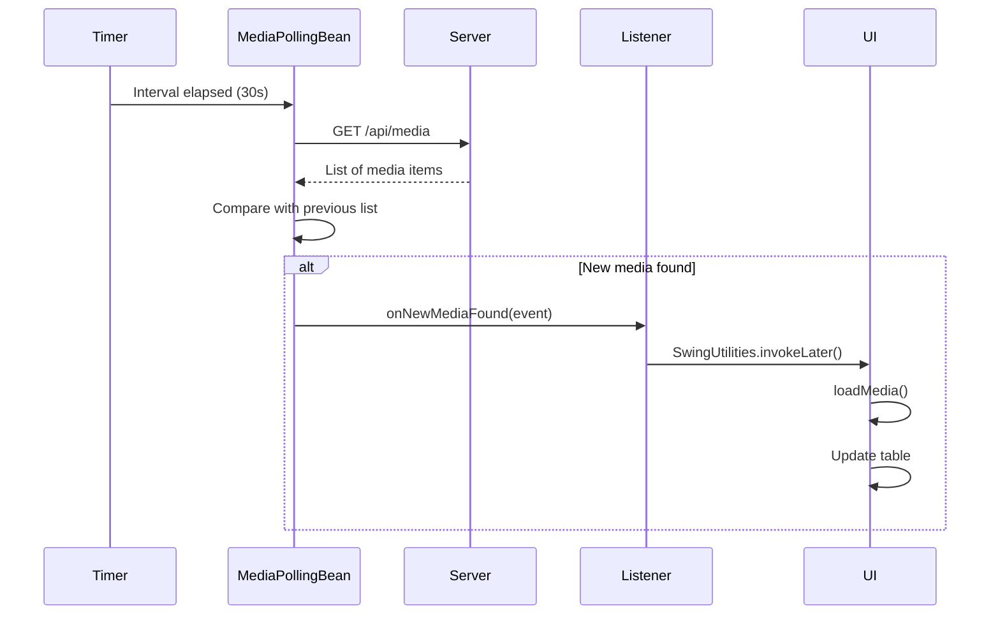

## Overview

MediaPollingBean uses a custom event system to notify your application when new media is detected on the cloud server. This enables real-time UI updates without manual refresh operations.

## Event System Architecture

The event system consists of three components:

```
┌──────────────────────────────────────┐
│   MediaPollingBean                   │
│   - Polling Timer                    │
│   - Media Comparison Logic           │
│   - Event Dispatcher                 │
└──────────────┬───────────────────────┘
               │ fires event
               ↓
┌──────────────────────────────────────┐
│   MediaPollingBeanEvent              │
│   - Event Data                       │
│   - Timestamp                        │
└──────────────┬───────────────────────┘
               │ delivered to
               ↓
┌──────────────────────────────────────┐
│   MediaPollingBeanListener           │
│   - onNewMediaFound(event)           │
└──────────────────────────────────────┘
               │ implemented by
               ↓
┌──────────────────────────────────────┐
│   Your Application (MainWindow)      │
│   - Update UI                        │
│   - Reload Library                   │
└──────────────────────────────────────┘
```

## MediaPollingBeanListener Interface

To receive events, your class must implement the `MediaPollingBeanListener` interface:

```java
public interface MediaPollingBeanListener extends EventListener {
    void onNewMediaFound(MediaPollingBeanEvent evt);
}
```

### Method: onNewMediaFound()

Called when the polling service detects new media on the server.

<ParamField path="evt" type="MediaPollingBeanEvent" required>
  The event object containing information about the detected media
</ParamField>

## Implementing the Listener

Here's how Tubify implements the listener in MainWindow:

```java MainWindow.java
public class MainWindow extends JFrame implements MediaPollingBeanListener {
    private final MediaPollingBean mediaPollingBean;
    private final LibraryPanel libraryPanel;
    
    public MainWindow() {
        // Initialize components
        mediaPollingBean = new MediaPollingBean();
        mediaPollingBean.setApiUrl("https://difreenet9.azurewebsites.net");
        mediaPollingBean.setPollingInterval(30);
        
        // Register this class as a listener
        mediaPollingBean.addMediaPollingBeanListener(this);
        
        libraryPanel = new LibraryPanel(this);
    }
    
    /**
     * Handles the event triggered when new media is detected.
     * This method is called automatically by MediaPollingBean.
     */
    @Override
    public void onNewMediaFound(MediaPollingBeanEvent evt) {
        if (libraryPanel != null) {
            // Reload the library to show new media
            libraryPanel.loadMedia();
        }
    }
}
```

**Reference:** [MainWindow.java:277-281](/home/daytona/workspace/source/src/main/java/es/perelluent/tubify/MainWindow.java:277)

<Note>
  The event handler is called on a background thread, so you may need to use `SwingUtilities.invokeLater()` for UI updates.
</Note>

## Event Registration

Register your listener during initialization:

<Steps>
  <Step title="Create MediaPollingBean instance">
    ```java
    mediaPollingBean = new MediaPollingBean();
    ```
  </Step>
  <Step title="Configure the bean">
    ```java
    mediaPollingBean.setApiUrl("https://difreenet9.azurewebsites.net");
    mediaPollingBean.setPollingInterval(30);
    ```
  </Step>
  <Step title="Register listener">
    ```java
    mediaPollingBean.addMediaPollingBeanListener(this);
    ```
  </Step>
  <Step title="Implement interface">
    Make sure your class implements `MediaPollingBeanListener`:
    ```java
    public class MainWindow extends JFrame implements MediaPollingBeanListener {
        @Override
        public void onNewMediaFound(MediaPollingBeanEvent evt) {
            // Handle event
        }
    }
    ```
  </Step>
</Steps>

**Reference:** [MainWindow.java:94](/home/daytona/workspace/source/src/main/java/es/perelluent/tubify/MainWindow.java:94)

## When Events Are Fired

The `onNewMediaFound` event is triggered when:

1. **Polling is enabled**: `mediaPollingBean.setRunning(true)`
2. **Timer interval elapses**: Based on `pollingInterval` (default: 30 seconds)
3. **New media detected**: The server returns media that wasn't present in the previous check

### Polling Lifecycle

```
User logs in
    ↓
Set running = true
    ↓
Timer starts (30s interval)
    ↓
┌───────────────────────────────────┐
│ Every 30 seconds:                 │
│  1. Call getAllMedia()            │
│  2. Compare with previous list    │
│  3. If new items found:           │
│     → Fire onNewMediaFound event  │
└───────────────────────────────────┘
    ↓
Your event handler called
    ↓
UI updates automatically
```

## Handling Events Safely

Since event handlers are called from background threads, follow these practices:

### Using SwingUtilities for UI Updates

```java
@Override
public void onNewMediaFound(MediaPollingBeanEvent evt) {
    // Update UI on the Event Dispatch Thread
    SwingUtilities.invokeLater(() -> {
        if (libraryPanel != null) {
            libraryPanel.loadMedia();
        }
        // Update status label
        statusLabel.setText("New media available!");
    });
}
```

### Avoiding Concurrent Modification

```java
@Override
public void onNewMediaFound(MediaPollingBeanEvent evt) {
    // Don't modify collections directly from event handler
    // Instead, schedule the update on the UI thread
    SwingUtilities.invokeLater(() -> {
        synchronized(mediaList) {
            mediaList.clear();
            mediaList.addAll(loadAllMedia());
        }
        tableModel.fireTableDataChanged();
    });
}
```

## Complete Example

Here's a complete implementation showing event handling:

```java
import es.perelluent.mediapollingbean.MediaPollingBean;
import es.perelluent.MediaPollingBeanEvent.MediaPollingBeanEvent;
import es.perelluent.MediaPollingBeanEvent.MediaPollingBeanListener;
import javax.swing.*;

public class MainWindow extends JFrame implements MediaPollingBeanListener {
    private final MediaPollingBean mediaPollingBean;
    private final LibraryPanel libraryPanel;
    private final JLabel statusLabel;
    
    public MainWindow() {
        // Initialize MediaPollingBean
        mediaPollingBean = new MediaPollingBean();
        mediaPollingBean.setApiUrl("https://difreenet9.azurewebsites.net");
        mediaPollingBean.setPollingInterval(30);
        
        // Register as listener
        mediaPollingBean.addMediaPollingBeanListener(this);
        
        // Initialize UI components
        libraryPanel = new LibraryPanel(this);
        statusLabel = new JLabel("Ready");
        
        // Set up UI
        getContentPane().add(libraryPanel, BorderLayout.CENTER);
        getContentPane().add(statusLabel, BorderLayout.SOUTH);
    }
    
    /**
     * Called when MediaPollingBean detects new media on the server.
     * This runs on a background thread, so we use SwingUtilities.invokeLater
     * to update the UI safely.
     */
    @Override
    public void onNewMediaFound(MediaPollingBeanEvent evt) {
        System.out.println("New media detected at " + new Date());
        
        // Update UI on Event Dispatch Thread
        SwingUtilities.invokeLater(() -> {
            // Reload library panel
            if (libraryPanel != null) {
                libraryPanel.loadMedia();
            }
            
            // Update status
            statusLabel.setText("New media available! Refreshed library.");
            
            // Optional: Show notification
            JOptionPane.showMessageDialog(
                this,
                "New media has been added to your library!",
                "Update Available",
                JOptionPane.INFORMATION_MESSAGE
            );
        });
    }
    
    public MediaPollingBean getMediaPollingBean() {
        return mediaPollingBean;
    }
}
```

## Unregistering Listeners

If you need to stop receiving events:

```java
// Remove listener
mediaPollingBean.removeMediaPollingBeanListener(this);

// Or stop polling entirely
mediaPollingBean.setRunning(false);
```

<Note>
  Stopping polling (`setRunning(false)`) prevents events from firing, but the listener remains registered. If you restart polling, events will resume.
</Note>

## Multiple Listeners

You can register multiple listeners to the same MediaPollingBean instance:

```java
// Register multiple components
mediaPollingBean.addMediaPollingBeanListener(mainWindow);
mediaPollingBean.addMediaPollingBeanListener(libraryPanel);
mediaPollingBean.addMediaPollingBeanListener(notificationManager);

// All three will receive onNewMediaFound events
```

## Debugging Events

Add logging to understand when events fire:

```java
@Override
public void onNewMediaFound(MediaPollingBeanEvent evt) {
    System.out.println("[" + new Date() + "] New media event received");
    System.out.println("Event source: " + evt.getSource());
    
    // Your event handling logic
    SwingUtilities.invokeLater(() -> {
        libraryPanel.loadMedia();
    });
}
```

## Common Use Cases

### Real-Time Library Sync

```java
@Override
public void onNewMediaFound(MediaPollingBeanEvent evt) {
    SwingUtilities.invokeLater(() -> {
        libraryPanel.loadMedia();
    });
}
```

### User Notifications

```java
@Override
public void onNewMediaFound(MediaPollingBeanEvent evt) {
    SwingUtilities.invokeLater(() -> {
        trayIcon.displayMessage(
            "Tubify",
            "New media available in your library",
            TrayIcon.MessageType.INFO
        );
    });
}
```

### Analytics Tracking

```java
@Override
public void onNewMediaFound(MediaPollingBeanEvent evt) {
    analyticsService.trackEvent("new_media_detected");
    
    SwingUtilities.invokeLater(() -> {
        libraryPanel.loadMedia();
    });
}
```

### Auto-Download

```java
@Override
public void onNewMediaFound(MediaPollingBeanEvent evt) {
    SwingUtilities.invokeLater(() -> {
        if (autoDownloadEnabled) {
            downloadManager.downloadNewMedia();
        }
    });
}
```

## Event Flow Diagram



## Best Practices

<Steps>
  <Step title="Use SwingUtilities.invokeLater()">
    Always update Swing components from the Event Dispatch Thread
  </Step>
  <Step title="Keep handlers lightweight">
    Don't perform heavy operations directly in the event handler
  </Step>
  <Step title="Handle errors gracefully">
    Wrap event handler code in try-catch to prevent crashes
  </Step>
  <Step title="Provide user feedback">
    Show notifications or status updates when new media is detected
  </Step>
  <Step title="Test polling intervals">
    Choose an interval that balances responsiveness with server load
  </Step>
</Steps>

## Troubleshooting

### Events Not Firing

<AccordionGroup>
  <Accordion title="Check if polling is enabled">
    ```java
    // Make sure polling is started
    mediaPollingBean.setRunning(true);
    
    // Verify it's running
    System.out.println("Polling active: " + mediaPollingBean.isRunning());
    ```
  </Accordion>
  
  <Accordion title="Verify listener is registered">
    ```java
    // Register listener during initialization
    mediaPollingBean.addMediaPollingBeanListener(this);
    
    // Verify interface is implemented
    if (this instanceof MediaPollingBeanListener) {
        System.out.println("Listener implemented correctly");
    }
    ```
  </Accordion>
  
  <Accordion title="Check authentication">
    ```java
    // Events require valid authentication
    if (mediaPollingBean.getToken() == null) {
        System.err.println("No token set - polling won't work");
    }
    ```
  </Accordion>
  
  <Accordion title="Verify network connectivity">
    ```java
    // Test if you can reach the API
    try {
        List<LibraryItem> items = mediaPollingBean.getAllMedia();
        System.out.println("API accessible, " + items.size() + " items");
    } catch (Exception e) {
        System.err.println("Cannot reach API: " + e.getMessage());
    }
    ```
  </Accordion>
</AccordionGroup>

## Next Steps

<CardGroup cols={2}>
  <Card title="Overview" icon="book" href="/cloud/overview">
    Return to cloud integration overview
  </Card>
  <Card title="API Methods" icon="code" href="/cloud/api-methods">
    Explore all available API methods
  </Card>
</CardGroup>
